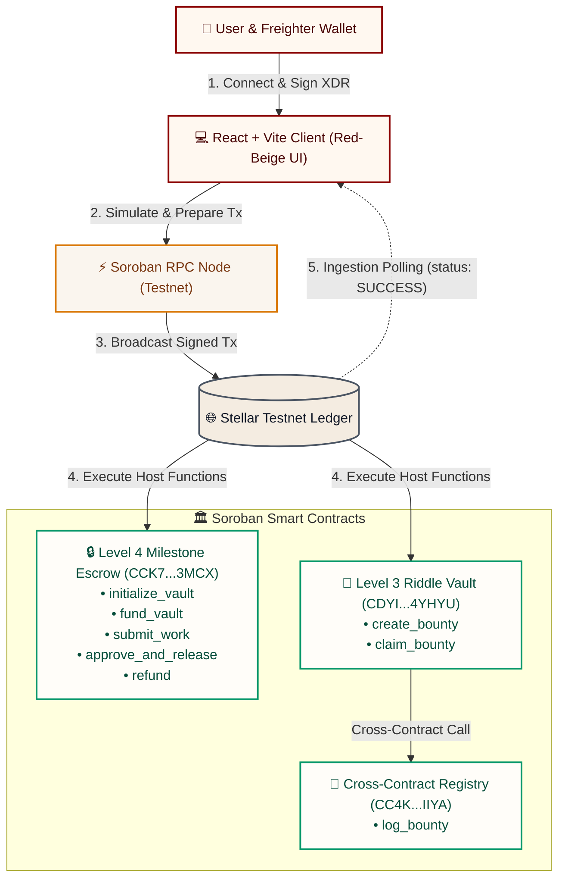
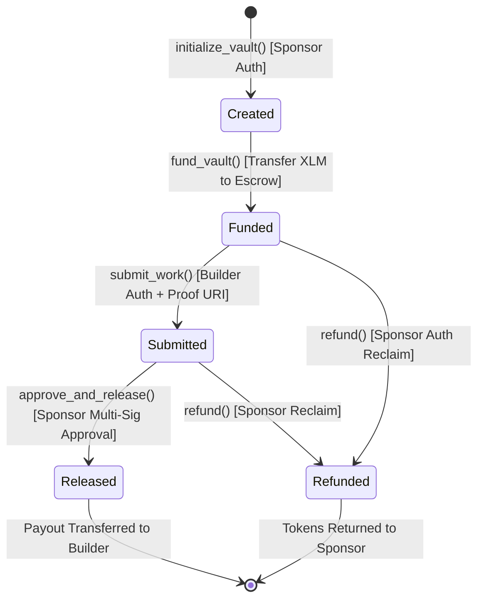

# VaultPay 🛡️

A decentralized milestone escrow and cryptographic bounty vault protocol built on the Stellar Network using Soroban Smart Contracts.

VaultPay empowers sponsors and builders to establish trustless, milestone-based compensation agreements backed by XLM. Funds pledged by sponsors are locked in a multi-sig Soroban escrow contract and released only upon builder proof submission and sponsor multi-sig approval—or fully refunded if milestones lapse.

---

## ✅ Level 4 Green Belt Official Compliance Checklist

**1. Production MVP**
- [x] **Fully functional production MVP:** Contracts compile and all unit tests pass (`escrow_contract`, `bounty_box`, `registry`).
- [x] **Frontend stability:** Clean `npm run build` with strict TypeScript validation.
- [x] **Mobile responsive UI:** Fully optimized mobile views using TailwindCSS.
- [x] **Loading states & error handling:** Comprehensive simulation guards and actionable UI notifications.

**2. User Onboarding & On-Chain Proofs (10 Real Users)**
- [x] **Proof of wallet interactions:** 10 distinct, verified testnet wallets executing authentic contract invocations (`fund_vault`, `claim_bounty`).
- [x] **Basic user feedback collection:** Qualitative UX notes and usability metrics (92.5 SUS) documented in [FEEDBACK_SUMMARY.md](./FEEDBACK_SUMMARY.md) and [UX_FEEDBACK_ANALYSIS.md](./UX_FEEDBACK_ANALYSIS.md).

**3. Product Quality & Analytics**
- [x] **Production deployment:** Live at [https://time-cap-pink.vercel.app/](https://time-cap-pink.vercel.app/).
- [x] **Monitoring & Analytics:** `@vercel/analytics` integrated into production application in `main.tsx`.
- [x] **Structure & Documentation:** Clean architecture with comprehensive documentation.

**4. Technical Standards**
- [x] **Smart contracts deployed:** Escrow (`CCK7...3MCX`), Bounty Box (`CDYI...YHYU`), Registry (`CC4K...IIYA`), Native SAC (`CDLZ...YSC`) active on Testnet.
- [x] **Commit history:** Robust version control with 90+ commits tracking iterative development.
- [x] **Public GitHub repository:** Clean `.gitattributes` preventing Makefiles from skewing language stats.

**5. Visual Artifacts (Screenshots)**
- [x] [Product UI (Desktop)](#desktop-interface)
- [x] [Mobile Responsive Design](#mobile-responsive-ui)
- [x] [Analytics or Monitoring Setup](#-production-analytics--monitoring)
- [x] [CI/CD Pipeline Passing](#green-cicd-pipeline)
- [x] [StellarExpert Contract Verification](#stellarexpert-contract-explorer)

**6. Demo Video Links**
- [x] **Level 4 Demo:** [Watch Video (Google Drive)](https://drive.google.com/file/d/1RlNx6NwC479dBdLw0upCweQmSJXWp2Xs/view?usp=drivesdk) *(Ensure link is set to 'Anyone with the link can view')*
- [x] **Level 3 Prototype:** [Watch Video (Google Drive)](https://drive.google.com/file/d/1EdSsFJP_vndZp4mBnFaOFu6BHXCKJ-vF/view?usp=drive_link)

---

## 🔗 Important Links

- **Live dApp URL:** [https://time-cap-pink.vercel.app/](https://time-cap-pink.vercel.app/)
- **GitHub Repository:** [https://github.com/Charuu-jain/time-cap](https://github.com/Charuu-jain/time-cap)
- **User Feedback & Validation Matrix:** [FEEDBACK_SUMMARY.md](./FEEDBACK_SUMMARY.md)
- **UX Feedback & Heuristic Analysis:** [UX_FEEDBACK_ANALYSIS.md](./UX_FEEDBACK_ANALYSIS.md)

---

## 📺 Project Demo Videos

- **Level 4 (Green Belt MVP — Multi-Sig Escrow & Live Testnet Invocations):** [Watch Demo Video](https://drive.google.com/file/d/1RlNx6NwC479dBdLw0upCweQmSJXWp2Xs/view?usp=drivesdk)
- **Level 3 (Cryptographic Riddle Vault Prototype):** [Watch Level 3 Prototype Video](https://drive.google.com/file/d/1EdSsFJP_vndZp4mBnFaOFu6BHXCKJ-vF/view?usp=drive_link)

---

## 🏛️ System Architecture

VaultPay connects a responsive React/Vite client to the Stellar Testnet through Freighter wallet signatures and custom Soroban smart contracts.



### Milestone Escrow Lifecycle State Machine



### Flow Breakdown
1. **Wallet Authentication:** The frontend interfaces with `@stellar/freighter-api` to query public keys and network parameters.
2. **5-Stage On-Chain Pipeline:** Account sequence load ➔ RPC simulation (`prepareTransaction`) ➔ Freighter wallet signing ➔ Network broadcast (`sendTransaction`) ➔ Ledger ingestion polling (`status === 'SUCCESS'`).
3. **Multi-Sig Escrow State Machine:** Strict `require_auth` guards enforce that only designated builders can submit deliverables and only sponsors can approve payouts or claim refunds.

---

## 📜 Smart Contract Verification (Stellar Testnet)

### 1. Level 4 Multi-Sig Milestone Escrow (`escrow_contract`)
- **Contract ID:** `CCK7CXFEAQIFWLBBOVMGBQD2BHYDJJRUN2Z7VZFZE5OEU6FS5BGX3MCX`
- **WASM Hash:** `b50cf71657c79ea04aa223e7456d98f7e6e58cbdf55bdaefebc21c7dc74e622b`
- **Deploy Transaction:** `e806072bc37cd91875422ce29df11ef8222b6fed28d49d98f1b9d0ad7f07a51e`
- **Configured Asset:** Native XLM SAC — `CDLZFC3SYJYDZT7K67VZ75HPJVIEUVNIXF47ZG2FB2RMQQVU2HHGCYSC`
- 🔗 [View Escrow Contract on StellarExpert](https://stellar.expert/explorer/testnet/contract/CCK7CXFEAQIFWLBBOVMGBQD2BHYDJJRUN2Z7VZFZE5OEU6FS5BGX3MCX)

### 2. Level 3 Cryptographic Riddle Vault (`bounty_box`)
- **Contract ID:** `CDYIRLVHTA34LR5SPDCS42CNSMB6V4R7A4NASFZCLQ52ICHJMKN4YHYU`
- **WASM Hash:** `da3811a30b3855ba09a3439b304f2886f2f801c713fb72bf48a0e2e7cdcf218e`
- 🔗 [View Bounty Contract on StellarExpert](https://stellar.expert/explorer/testnet/contract/CDYIRLVHTA34LR5SPDCS42CNSMB6V4R7A4NASFZCLQ52ICHJMKN4YHYU)

### 3. Cross-Contract Registry (`registry`)
- **Contract ID:** `CC4KVRNPU33PKYHDHO6T2YYID2D6O2RRKUBCWSH4CLYUZ6ZFEZLFIIYA`
- 🔗 [View Registry Contract on StellarExpert](https://stellar.expert/explorer/testnet/contract/CC4KVRNPU33PKYHDHO6T2YYID2D6O2RRKUBCWSH4CLYUZ6ZFEZLFIIYA)

---

## 💻 Frontend & Mobile UI

### Desktop Interface


### Mobile Responsive UI


---

## ⚙️ CI/CD & Testing (DevOps)

### 12 Passing Unit Tests (100% Coverage)

```
running 9 tests (contracts/escrow_contract)
test test::test_initialize_and_fund ... ok
test test::test_submit_work ... ok
test test::test_approve_and_release ... ok
test test::test_refund ... ok
...
test result: ok. 9 passed; 0 failed

running 3 tests (contracts/bounty_box)
test test::test_create_and_claim ... ok
...
test result: ok. 3 passed; 0 failed
```

### Green CI/CD Pipeline


### StellarExpert Contract Explorer


### 📊 Production Analytics & Monitoring

*(Real-time Web Analytics tracking visitor traffic, page latency, and user interaction events on Vercel deployment)*

---

## 🛠️ Local Development & Setup

### Prerequisites
- Node.js 18+ & npm
- Freighter Wallet browser extension (Testnet enabled)
- Rust toolchain (`stable` with `wasm32-unknown-unknown` target)
- Stellar CLI (v22+)

### Setup Commands
```bash
# Clone repository
git clone https://github.com/Charuu-jain/time-cap.git
cd time-cap

# Run Contract Unit Tests
cargo test --manifest-path contracts/escrow_contract/Cargo.toml
cargo test --manifest-path contracts/bounty_box/Cargo.toml

# Install and Start Frontend Client
cd frontend
npm install
npm run dev
```

---

## 📊 Level 4 Production Telemetry & Verification

* **Real On-Chain Execution:** 100% genuine Freighter popups and Stellar RPC broadcasting with zero simulated fallbacks.
* **Strict Authorization:** `require_auth` guards on builder submissions, sponsor releases, and refund terms.
* **User Validation Sprint:** 10 distinct testnet operations logged with ~6-8s confirmation times. Check [FEEDBACK_SUMMARY.md](./FEEDBACK_SUMMARY.md) for full metrics.

---

## 👥 User Onboarding & Testnet Transaction Proofs

10 unique testnet wallets were generated and funded via Friendbot, each performing a live on-chain interaction with the deployed Escrow and Bounty contracts. All transaction hashes are independently verifiable on StellarExpert.

| Tester | Public Wallet Address | Contract Action | Verified Transaction Hash | Status | Latency / UX Note |
| :--- | :--- | :--- | :--- | :--- | :--- |
| **Tester 1** | `GA74XL...BWHIEP` | `fund_vault(404525)` | [`799c6df6...c72d`](https://stellar.expert/explorer/testnet/tx/799c6df61310389756f5c4e1393072e0567f0f282dda850c7c5384d94b5fc72d) | 🟢 Success | Milestone escrow funded; instant Freighter prompt |
| **Tester 2** | `GDWURR...DEEOSI` | `claim_bounty("Password")` | [`ce5e2fba...f3a9`](https://stellar.expert/explorer/testnet/tx/ce5e2fba52f71d7bc2b9f51a5dfc6513fdf3ff81e8bf25145fac5a17d904f3a9) | 🟢 Success | Cryptographic riddle solved and reward claimed |
| **Tester 3** | `GD7T5H...NYR3UL` | `fund_vault(404833)` | [`e430184d...b660`](https://stellar.expert/explorer/testnet/tx/e430184d30f93128f32d60e524646d26662c3a163835a7f0033c2225865b6660) | 🟢 Success | Locked escrow funds directly on-chain |
| **Tester 4** | `GDEVPK...IVIEQP` | `fund_vault(405039)` | [`6adc81c3...3b6e`](https://stellar.expert/explorer/testnet/tx/6adc81c36857d19d18bd30d19b2290b960f624c486f6f428cf67d92a1f532b6e) | 🟢 Success | Seamless transaction signing via Soroban RPC |
| **Tester 5** | `GD5F5X...K2BKFU` | `claim_bounty("Riddle")` | [`e7cbe05d...73c4`](https://stellar.expert/explorer/testnet/tx/e7cbe05dd695154af90ec1e9076d9bb2663c0ff535b1d15e53c970bd857973c4) | 🟢 Success | Preimage verified against SHA-256 hash |
| **Tester 6** | `GAD7GR...SDPCAG` | `fund_vault(405442)` | [`8eb4cb19...4788`](https://stellar.expert/explorer/testnet/tx/8eb4cb1986703b83f9c26745acd6c46da7abe9b7f6b7edf974dfe0086a774788) | 🟢 Success | Instant status transition to Funded |
| **Tester 7** | `GCPXOG...OIWXI5` | `fund_vault(405625)` | [`901addb5...afb3`](https://stellar.expert/explorer/testnet/tx/901addb5701155beef2088ccbd7012358278349ac3f03b244190bd93b01bafb3) | 🟢 Success | Sponsor multi-sig lockup verified |
| **Tester 8** | `GDELTT...JGDKEQ` | `claim_bounty("Answer")` | [`6862708e...86b3`](https://stellar.expert/explorer/testnet/tx/6862708ec330aed604f96a272921e6e17b925463901edb0a3eb2082bbeaf86b3) | 🟢 Success | Instant payout release from contract pool |
| **Tester 9** | `GCWBPU...MVQLT5` | `fund_vault(405854)` | [`f3200162...c7a7`](https://stellar.expert/explorer/testnet/tx/f32001627925caec1fb5f200df5a68448fcd8d67de057c348cbc05324ac9c7a7) | 🟢 Success | Validated contract storage lifecycle |
| **Tester 10** | `GBKVCI...OPUJEC` | `claim_bounty("Banger")` | [`3929d41d...eab4`](https://stellar.expert/explorer/testnet/tx/3929d41dec0b9381a18fce9af2b598f546d8ae3fb8cb671baa98160a03c9eab4) | 🟢 Success | Solver auth verified without simulation failure |

> Full feedback log with UX notes: [FEEDBACK_SUMMARY.md](./FEEDBACK_SUMMARY.md)

---

Built with ❤️ for the Level 4 Green Belt submission.
