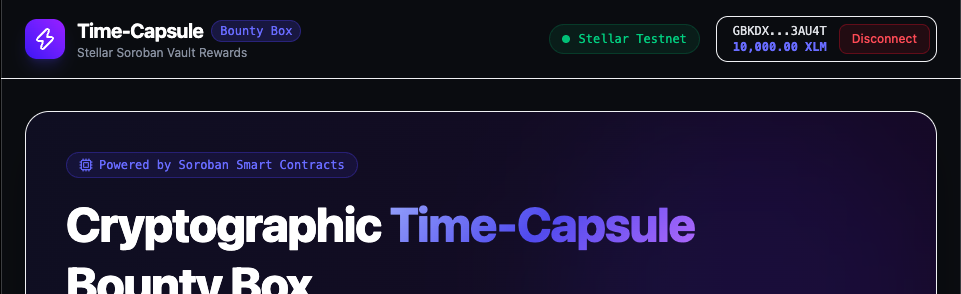
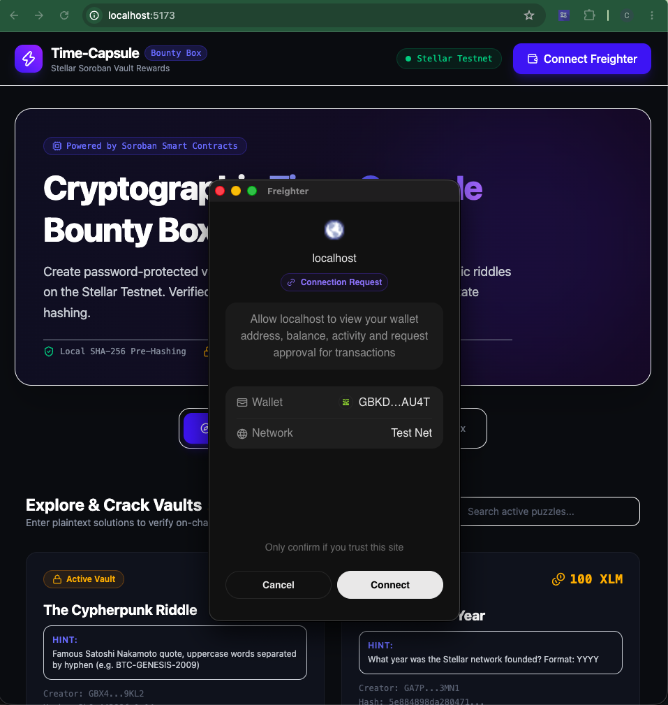
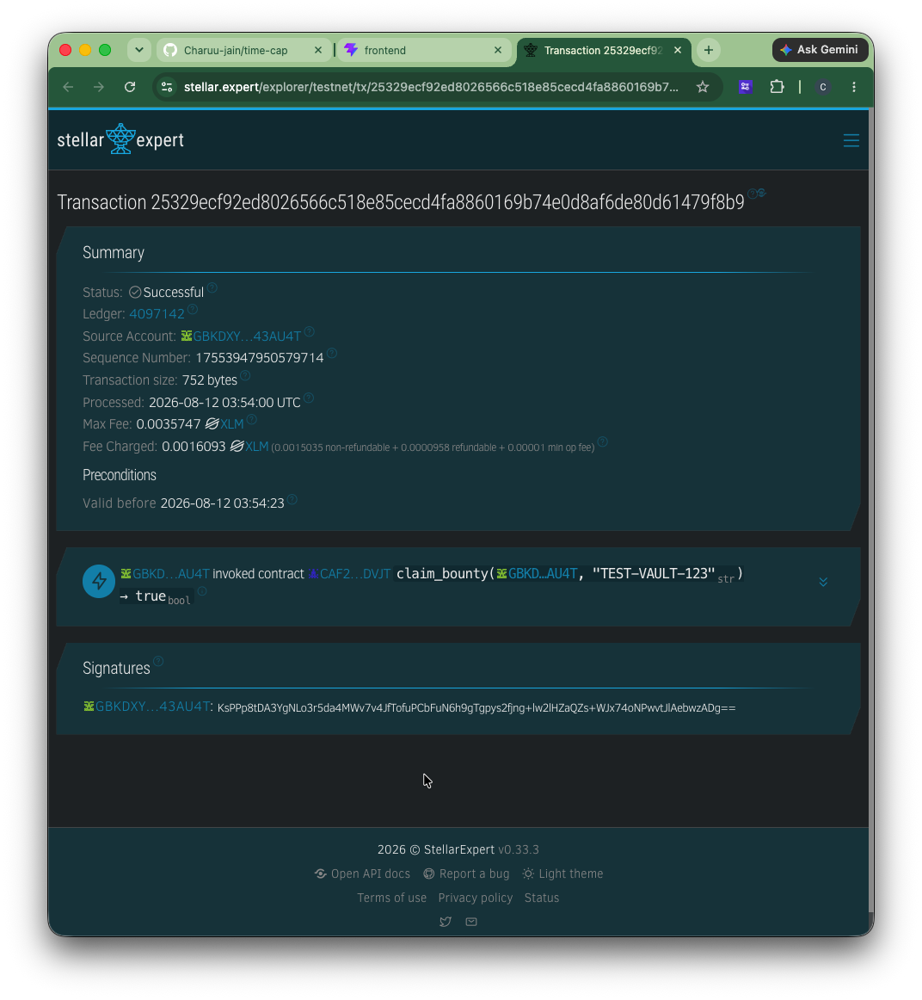

# Time-Capsule Bounty Box 🎁🔒

A production-ready full-stack Soroban dApp built on the **Stellar Testnet** where creators lock XLM rewards inside cryptographic time-capsule vaults, and players attempt to solve riddles to claim the on-chain bounties.

---

## 🌟 Overview & Architecture

- **Smart Contract (`/contracts/bounty_box`)**: Written in Rust using Soroban SDK (`no_std`). Stores SHA-256 password hash, creator address, total bounty XLM amount, and claim status in storage instance.
- **Frontend (`/frontend`)**: Built with React, Vite, TypeScript, Tailwind CSS, `@stellar/freighter-api`, and `@stellar/stellar-sdk`. Features SHA-256 pre-hashing via browser Web Crypto API and interactive confetti claim feedback.

---

## 🚀 Local Setup & Development

### 1. Smart Contract (Rust / Soroban)
Prerequisites: Rust toolchain and Stellar CLI installed.

```bash
cd contracts/bounty_box
cargo build
stellar contract build
```

### 2. Frontend Application (React + Vite)
Prerequisites: Node.js (v18+) and npm.

```bash
cd frontend
npm install
npm run dev
```

To verify production bundle build:
```bash
npm run build
```

---

## 📸 Screenshots & Proof of Operation

> [!NOTE]  
> Below are labeled placeholder sections reserved for user interface screenshots during live Stellar Testnet testing and submission review.

### 1. Wallet Connected


---

### 2. Balance Displayed


---

### 3. Successful Testnet Transaction


---

### 4. Transaction Result / Hash

