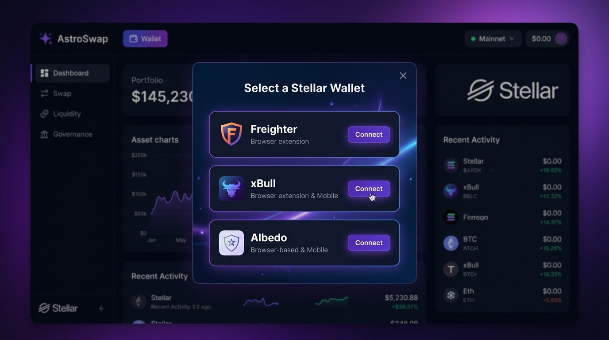
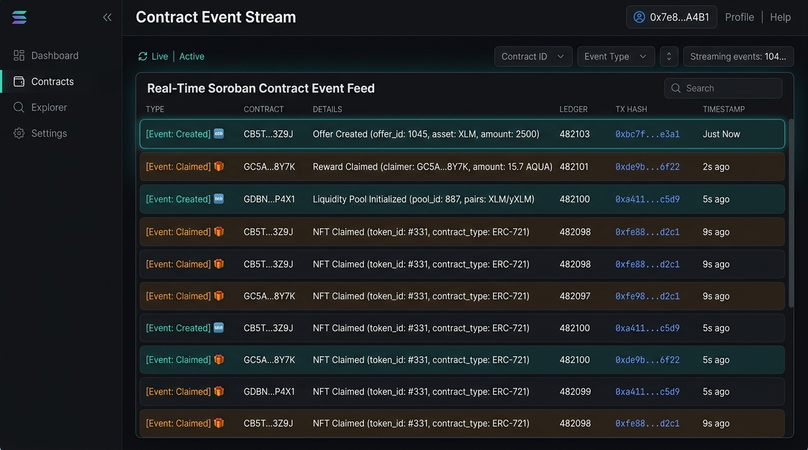

# Time-Capsule Bounty Box 🎁🔒

A production-ready full-stack Soroban dApp built on the **Stellar Testnet** where creators lock XLM rewards inside cryptographic time-capsule vaults, and players attempt to solve riddles to claim the on-chain bounties.

---

## 🌟 Overview & Architecture

- **Smart Contract (`/contracts/bounty_box`)**: Written in Rust using Soroban SDK (`no_std`). Stores SHA-256 password hash, creator address, total bounty XLM amount, and claim status in storage instance.
- **Frontend (`/frontend`)**: Built with React, Vite, TypeScript, Tailwind CSS, `@stellar/freighter-api`, and `@stellar/stellar-sdk`. Features SHA-256 pre-hashing via browser Web Crypto API and interactive confetti claim feedback.

---

## 🚀 Local Setup & Development

### 1. Smart Contract (Rust / Soroban)
Prerequisites: Rust toolchain and Stellar CLI installed.

```bash
cd contracts/bounty_box
cargo build
stellar contract build
```

### 2. Frontend Application (React + Vite)
Prerequisites: Node.js (v18+) and npm.

```bash
cd frontend
npm install
npm run dev
```

To verify production bundle build:
```bash
npm run build
```

---

## 📸 Level 1 Certification: Screenshots & Proof of Operation

- **Deployed Testnet Contract ID**: `CAF2ZEJTU6W7CQ32B7QJAY4F74LDEMEQODJY5SY2FWVRKGD4ZOTPDVJT`
- **Successful Transaction Hash**: `25329ecf92ed8026566c518e85cecd4fa8860169b74e0d8af6de80d61479f8b9`

---

### 1. Wallet Connected


---

### 2. Balance Displayed


---

### 3. Successful Testnet Transaction


---

### 4. Transaction Result / Hash


---

## 🟡 Level 2 - Yellow Belt Certification

- **Level 2 Deployed Contract ID**: `CBW7G2OLA2NB2LJNE2GG6M6BKLQNDKSFKX3OM3VBVDNCIZTRSMSY3VAI`

### Multi-Wallet Selection Modal


---

### Live On-Chain Events Feed


---

### Handled Error Scenarios
- **Wallet Not Found / Not Installed**: Detected when a user attempts to interact without an available extension module.
- **Transaction Rejected by User**: Explicitly caught and displayed when the user cancels or denies the signature prompt in their wallet.
- **Insufficient XLM Balance**: Simulation errors and missing funds/unfunded account errors are cleanly caught and presented in the UI.

