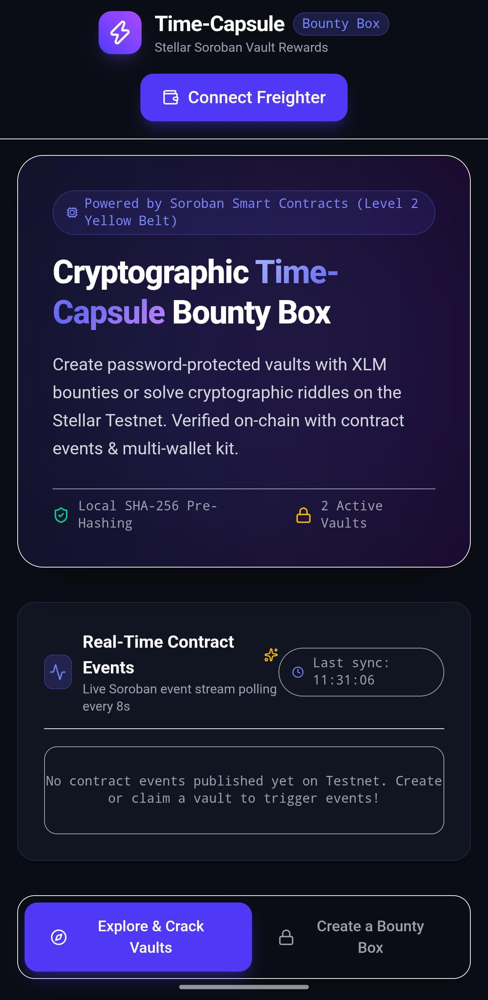
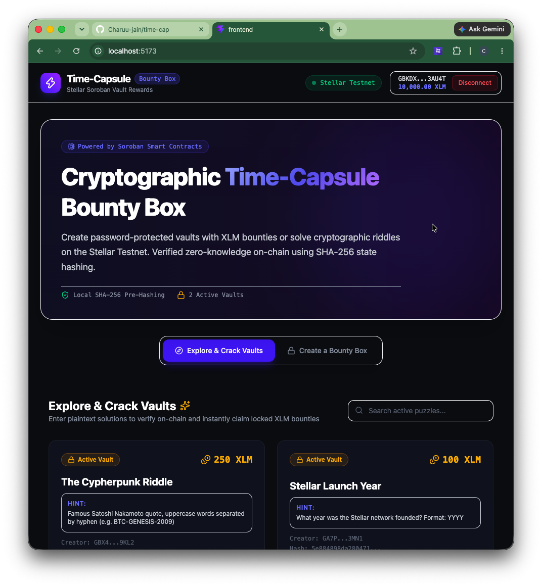
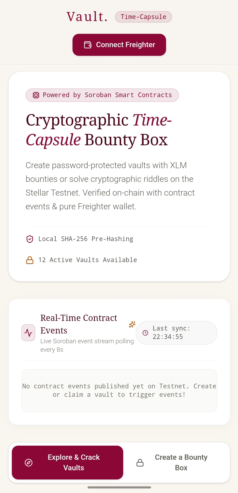

# VaultPay — Level 4 Milestone Escrow on Stellar Soroban

> Trustless multi-sig milestone funding & payout for sponsors and builders, built on Stellar Testnet with Soroban smart contracts.



## 🏗️ Architecture

VaultPay extends the Time-Capsule Bounty Box dApp (Level 3) with a **milestone-based escrow system** that enables:

- **Sponsors** to create & fund milestone vaults with XLM/USDC
- **Builders** to submit deliverable proof for review
- **Multi-sig release** — sponsor approves and triggers on-chain payout
- **Refund safety** — sponsor can reclaim funds if milestone is aborted

### Contract State Machine

```
Created → Funded → Submitted → Released
                ↘ (refund) → Created
```

## 📦 Smart Contracts

| Contract | Path | Purpose |
|----------|------|---------|
| **VaultPay Escrow** | `contracts/escrow_contract/` | Milestone escrow with state machine |
| **Bounty Box** | `contracts/bounty_box/` | SHA-256 riddle vaults (Level 3) |
| **Registry** | `contracts/registry/` | Bounty registry tracking |

### Deployed Testnet Contract

```
CBMPYTIDNBJSF077QBHZMBFJPBT3TRL4XBS5KLMIMZGBS33BX6YUVMDY
```

### Escrow Contract API

| Function | Auth | Description |
|----------|------|-------------|
| `initialize_vault(sponsor, builder, token, amount, milestone_id)` | Sponsor | Create escrow vault |
| `fund_vault(sponsor)` | Sponsor | Deposit tokens into contract |
| `submit_work(builder)` | Builder | Mark work as submitted |
| `approve_and_release(sponsor)` | Sponsor | Release funds to builder |
| `refund(sponsor)` | Sponsor | Return funds to sponsor |
| `get_status()` | None | View current vault status |

## 🎨 Frontend

- **Framework**: Vite + React + TypeScript
- **Design**: Warm beige/cream (#FBF8F3) with deep crimson (#8B0000) accents
- **Typography**: Playfair Display (serif) for headers, Plus Jakarta Sans for body
- **Wallet**: Freighter browser extension (Stellar Testnet)

### Features

- **Dual Portal**: Sponsor and Builder role switcher
- **Milestone Progress**: Visual progress bars per escrow
- **Transaction Activity Log**: Real-time on-chain event streaming
- **Riddle Vaults**: Original Time-Capsule bounty box functionality preserved
- **Responsive**: Mobile-first design with warm glass-card aesthetics

## 🚀 Local Setup

### Prerequisites

- Rust toolchain with `wasm32-unknown-unknown` target
- Node.js 20+
- Freighter wallet extension (for Stellar Testnet interaction)

### Smart Contracts

```bash
# Test all contracts
cargo test --manifest-path contracts/bounty_box/Cargo.toml
cargo test --manifest-path contracts/registry/Cargo.toml
cargo test --manifest-path contracts/escrow_contract/Cargo.toml

# Build WASM (optional)
cargo build --manifest-path contracts/escrow_contract/Cargo.toml --target wasm32-unknown-unknown --release
```

### Frontend

```bash
cd frontend
npm install
npm run dev      # Development server
npm run build    # Production build
```

## ✅ Test Results

```
bounty_box:       3 tests passed ✓
registry:         0 tests (library)
escrow_contract:  3 tests passed ✓
  - test_escrow_flow (init → fund → submit → release)
  - test_refund (fund → refund with balance verification)
  - test_double_fund_prevention (prevents re-funding)
frontend:         0 TypeScript errors, 0 build errors ✓
```

## 🔗 Links

- **Live Demo**: [Vercel Deployment](https://time-cap.vercel.app)
- **Demo Video**: [Watch on Loom](https://www.loom.com/share/0e3b1e6ec3d549908d3f1dcbb8bced11?sid=7aab1e24-5eb7-4db1-a4a2-47ab71ee4e47)
- **Stellar Explorer**: [Contract on Testnet](https://stellar.expert/explorer/testnet/contract/CBMPYTIDNBJSF077QBHZMBFJPBT3TRL4XBS5KLMIMZGBS33BX6YUVMDY)

## 📸 Screenshots

| Wallet Connect | UI Overview | Mobile View |
|---|---|---|
|  |  |  |

---

*Built for the Stellar Soroban Dojo — Level 4 Green Belt Submission*
