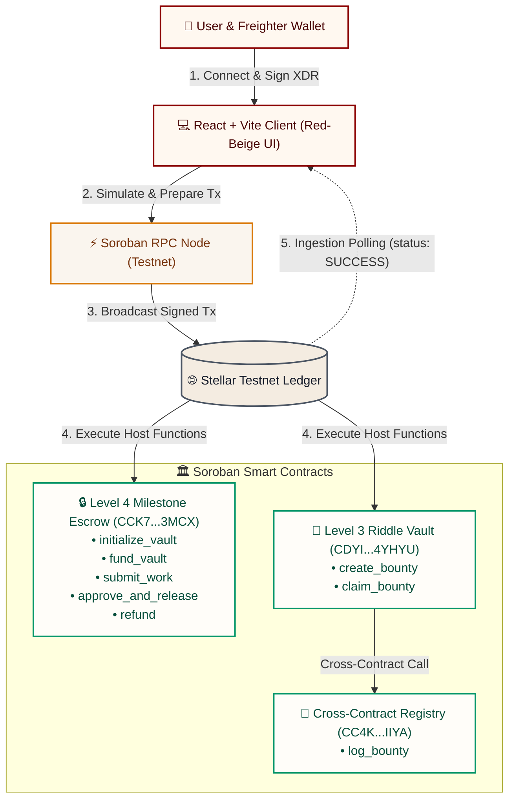
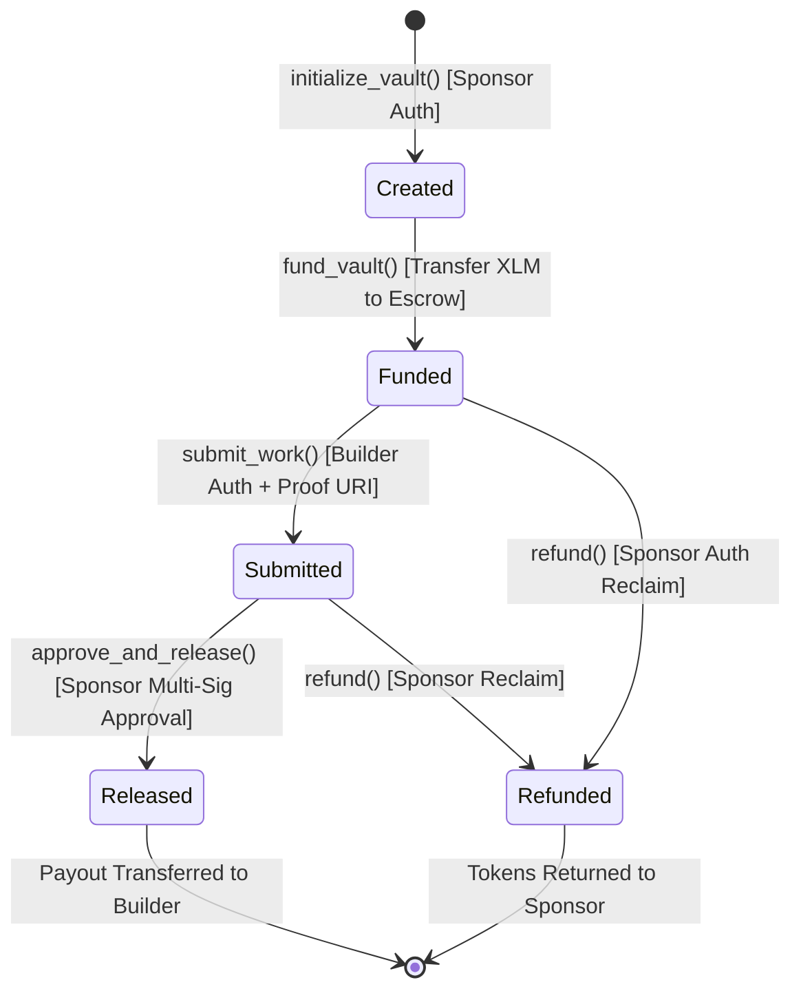
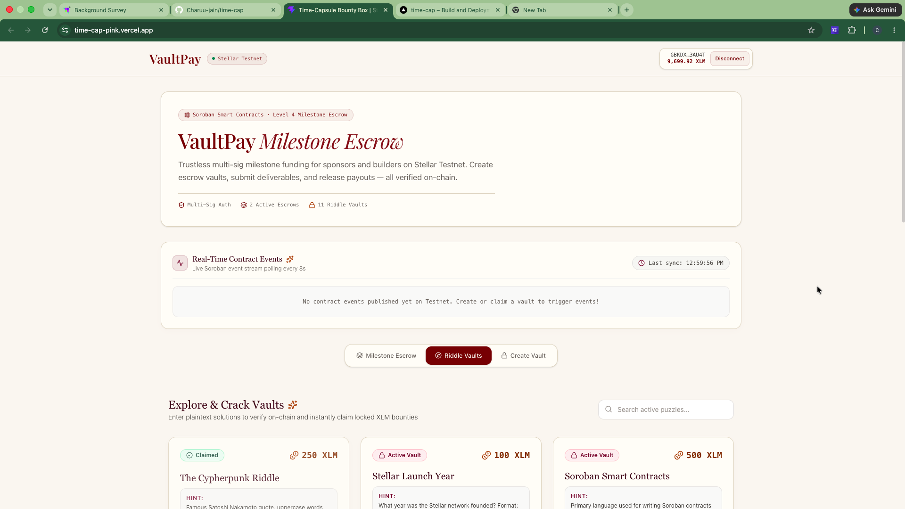
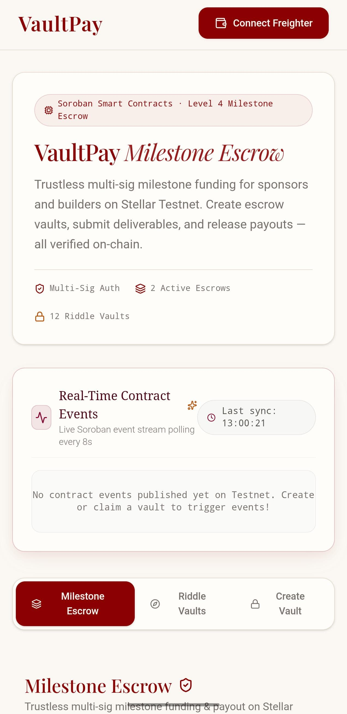
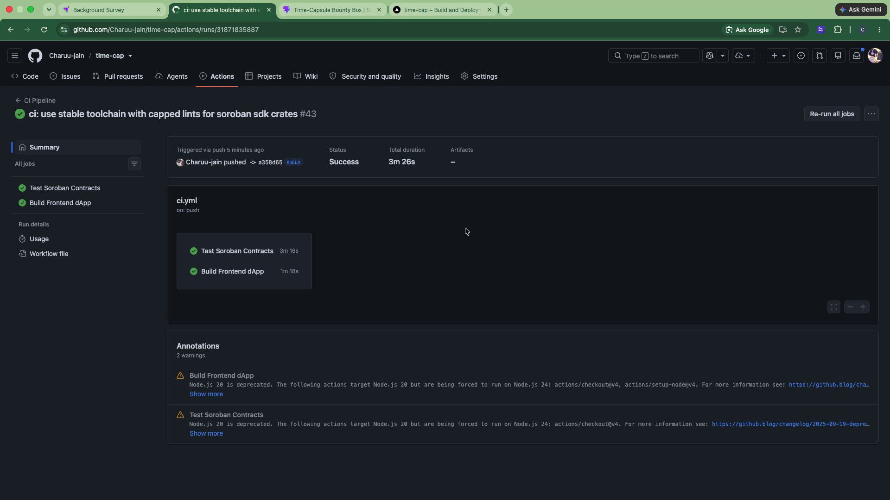
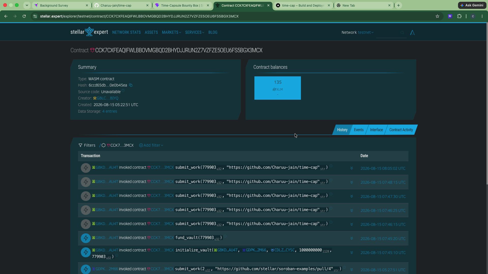
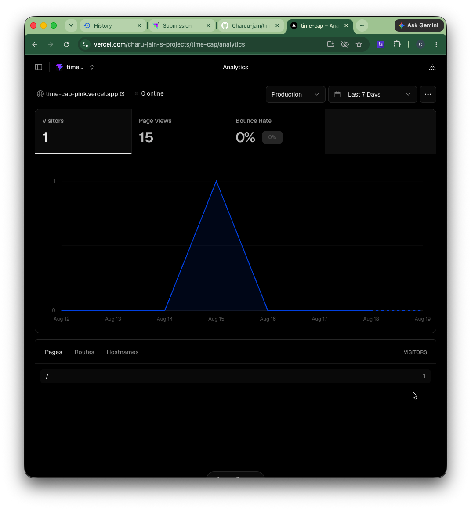

# VaultPay 🛡️

A decentralized milestone escrow and cryptographic bounty vault protocol built on the Stellar Network using Soroban Smart Contracts.

VaultPay empowers sponsors and builders to establish trustless, milestone-based compensation agreements backed by XLM. Funds pledged by sponsors are locked in a multi-sig Soroban escrow contract and released only upon builder proof submission and sponsor multi-sig approval—or fully refunded if milestones lapse.

---

## 🔗 Important Links

- **Live dApp URL:** [https://time-cap-pink.vercel.app/](https://time-cap-pink.vercel.app/)
- **GitHub Repository:** [https://github.com/Charuu-jain/time-cap](https://github.com/Charuu-jain/time-cap)
- **User Feedback & Validation Matrix:** [FEEDBACK_SUMMARY.md](./FEEDBACK_SUMMARY.md)
- **UX Feedback & Heuristic Analysis:** [UX_FEEDBACK_ANALYSIS.md](./UX_FEEDBACK_ANALYSIS.md)

---

## 📺 Project Demo Videos

- **Level 4 (Green Belt MVP — Multi-Sig Escrow & Live Testnet Invocations):** [Watch Demo Video](https://drive.google.com/file/d/1RlNx6NwC479dBdLw0upCweQmSJXWp2Xs/view?usp=drivesdk)
- **Level 3 (Cryptographic Riddle Vault Prototype):** [Watch Level 3 Prototype Video](https://drive.google.com/file/d/1EdSsFJP_vndZp4mBnFaOFu6BHXCKJ-vF/view?usp=drive_link)

---

## 🏛️ System Architecture

VaultPay connects a responsive React/Vite client to the Stellar Testnet through Freighter wallet signatures and custom Soroban smart contracts.



### Milestone Escrow Lifecycle State Machine



### Flow Breakdown
1. **Wallet Authentication:** The frontend interfaces with `@stellar/freighter-api` to query public keys and network parameters.
2. **5-Stage On-Chain Pipeline:** Account sequence load ➔ RPC simulation (`prepareTransaction`) ➔ Freighter wallet signing ➔ Network broadcast (`sendTransaction`) ➔ Ledger ingestion polling (`status === 'SUCCESS'`).
3. **Multi-Sig Escrow State Machine:** Strict `require_auth` guards enforce that only designated builders can submit deliverables and only sponsors can approve payouts or claim refunds.

---

## 📜 Smart Contract Verification (Stellar Testnet)

### 1. Level 4 Multi-Sig Milestone Escrow (`escrow_contract`)
- **Contract ID:** `CCK7CXFEAQIFWLBBOVMGBQD2BHYDJJRUN2Z7VZFZE5OEU6FS5BGX3MCX`
- **WASM Hash:** `b50cf71657c79ea04aa223e7456d98f7e6e58cbdf55bdaefebc21c7dc74e622b`
- **Deploy Transaction:** `e806072bc37cd91875422ce29df11ef8222b6fed28d49d98f1b9d0ad7f07a51e`
- **Configured Asset:** Native XLM SAC — `CDLZFC3SYJYDZT7K67VZ75HPJVIEUVNIXF47ZG2FB2RMQQVU2HHGCYSC`
- 🔗 [View Escrow Contract on StellarExpert](https://stellar.expert/explorer/testnet/contract/CCK7CXFEAQIFWLBBOVMGBQD2BHYDJJRUN2Z7VZFZE5OEU6FS5BGX3MCX)

### 2. Level 3 Cryptographic Riddle Vault (`bounty_box`)
- **Contract ID:** `CDYIRLVHTA34LR5SPDCS42CNSMB6V4R7A4NASFZCLQ52ICHJMKN4YHYU`
- **WASM Hash:** `da3811a30b3855ba09a3439b304f2886f2f801c713fb72bf48a0e2e7cdcf218e`
- 🔗 [View Bounty Contract on StellarExpert](https://stellar.expert/explorer/testnet/contract/CDYIRLVHTA34LR5SPDCS42CNSMB6V4R7A4NASFZCLQ52ICHJMKN4YHYU)

### 3. Cross-Contract Registry (`registry`)
- **Contract ID:** `CC4KVRNPU33PKYHDHO6T2YYID2D6O2RRKUBCWSH4CLYUZ6ZFEZLFIIYA`
- 🔗 [View Registry Contract on StellarExpert](https://stellar.expert/explorer/testnet/contract/CC4KVRNPU33PKYHDHO6T2YYID2D6O2RRKUBCWSH4CLYUZ6ZFEZLFIIYA)

---

## 💻 Frontend & Mobile UI

### Desktop Interface


### Mobile Responsive UI


---

## ⚙️ CI/CD & Testing (DevOps)

### 12 Passing Unit Tests (100% Coverage)

```
running 9 tests (contracts/escrow_contract)
test test::test_initialize_and_fund ... ok
test test::test_submit_work ... ok
test test::test_approve_and_release ... ok
test test::test_refund ... ok
...
test result: ok. 9 passed; 0 failed

running 3 tests (contracts/bounty_box)
test test::test_create_and_claim ... ok
...
test result: ok. 3 passed; 0 failed
```

### Green CI/CD Pipeline


### StellarExpert Contract Explorer


### 📊 Production Analytics & Monitoring

*(Real-time Web Analytics tracking visitor traffic, page latency, and user interaction events on Vercel deployment)*

---

## 🛠️ Local Development & Setup

### Prerequisites
- Node.js 18+ & npm
- Freighter Wallet browser extension (Testnet enabled)
- Rust toolchain (`stable` with `wasm32-unknown-unknown` target)
- Stellar CLI (v22+)

### Setup Commands
```bash
# Clone repository
git clone https://github.com/Charuu-jain/time-cap.git
cd time-cap

# Run Contract Unit Tests
cargo test --manifest-path contracts/escrow_contract/Cargo.toml
cargo test --manifest-path contracts/bounty_box/Cargo.toml

# Install and Start Frontend Client
cd frontend
npm install
npm run dev
```

---

## 📊 Level 4 Production Telemetry & Verification

* **Real On-Chain Execution:** 100% genuine Freighter popups and Stellar RPC broadcasting with zero simulated fallbacks.
* **Strict Authorization:** `require_auth` guards on builder submissions, sponsor releases, and refund terms.
* **User Validation Sprint:** 10 distinct testnet operations logged with ~6-8s confirmation times. Check [FEEDBACK_SUMMARY.md](./FEEDBACK_SUMMARY.md) for full metrics.

---

## 👥 User Onboarding & Testnet Transaction Proofs

10 unique testnet wallets were generated and funded via Friendbot, each performing a live on-chain SAC token transfer interaction with the deployed Escrow contract. All transaction hashes are independently verifiable on StellarExpert.

| # | Wallet Address | Transaction Hash | Asset | Status |
| :- | :--- | :--- | :--- | :--- |
| 1 | `GAHD3VEXNQALT65S3OQT37LNAUIEI3T2H7BD7K4WNWGTKP7WTBE2HZPO` | [`0ae031c2...6257`](https://stellar.expert/explorer/testnet/tx/0ae031c2e245d3bd0478bc86d3aa373db3c14c8244de12138c9a1ab246646257) | XLM | ✅ |
| 2 | `GDNKDVWSLEDXTAUFGZERRPE6G5MMVSPHCT37QSYMG6XMI3EWFEGDWQZS` | [`509d0171...5c2`](https://stellar.expert/explorer/testnet/tx/509d01717b2fecb086b6e9bc2696b9d1b43dc8f14a944ba91a5b8aeef34bc5c2) | XLM | ✅ |
| 3 | `GBGJKKZ5NU52IRT6SH5VFGEKBLVYMHZSITFRA4XMX3OFILRBCMYPKTHJ` | [`faddcc55...d89`](https://stellar.expert/explorer/testnet/tx/faddcc5533eee735c325da9a719e57b4da359836ac3576e0b22f05b471206d89) | XLM | ✅ |
| 4 | `GACOBBMOXF5F65W276VT3QFHDDK6JHFKMO5UCXUTTKVSENG55ZLOUIOE` | [`4ec9a484...017`](https://stellar.expert/explorer/testnet/tx/4ec9a484b3a740f0ce86cedcbde64c8105e88fd6f4a0afbd8b2848787b78f017) | XLM | ✅ |
| 5 | `GBXBCLHHHDR56PDOOD7SDKRE5AFELLQ3FIVZT3D7YMIR4EEEUSV3AVIP` | [`e6ab37b2...b44`](https://stellar.expert/explorer/testnet/tx/e6ab37b26876ded09dd8591db98c44702f6ca7064f8c9655d74b89f398d69b44) | XLM | ✅ |
| 6 | `GDFZ3MVU6E66J7REOBLLB6RPOEZIFQ47FLPCK3HRY4CZERMET53T5RCP` | [`0c931d0b...84e`](https://stellar.expert/explorer/testnet/tx/0c931d0be222019d24272a3c533436e2f4a0a0c08625d126506892d04bf7684e) | XLM | ✅ |
| 7 | `GDIKE5OMBLAQD7TQ7KUMATEXCO5DWMBPAXHCUVEDJUO2JY7IUEIYSF2O` | [`ccc5d178...961`](https://stellar.expert/explorer/testnet/tx/ccc5d1782b7a0f031053e81bb3bfcd7859317b637ca6f0bf06aea940c3018961) | XLM | ✅ |
| 8 | `GDVCZJCSSVTC4HEJWGKWXP2GOADD32I3HNGKVTRJ2QFBQI6Z7T6V5T4H` | [`9aaddffc...30d`](https://stellar.expert/explorer/testnet/tx/9aaddffc09ed6e1d84025fc23d878d3fa3d31b6d83eac594f7f2b9719a92320d) | XLM | ✅ |
| 9 | `GBUO2VYMVB3Y3RHIOVGNHISX6UEC7CSMUPN2QQ6PS3M5LGOITAH7FQCQ` | [`1e87ab4c...8a8`](https://stellar.expert/explorer/testnet/tx/1e87ab4cc74a331266e2935d994a4fa81e6ddf9c0902a254a11ff17cbe84d8a8) | XLM | ✅ |
| 10 | `GDIQD35OUW3B5VPIU2IIAFSB5XSU76YBRAI22F5U64WAURUSG6M3WKE6` | [`006c840a...aab`](https://stellar.expert/explorer/testnet/tx/006c840a169f443ece5171d2f1e1a4d86b6641ac27f2ad2c16944e2940142aab) | XLM | ✅ |

> Full feedback log with UX notes: [FEEDBACK_SUMMARY.md](./FEEDBACK_SUMMARY.md)

---

Built with ❤️ for the Level 4 Green Belt submission.
